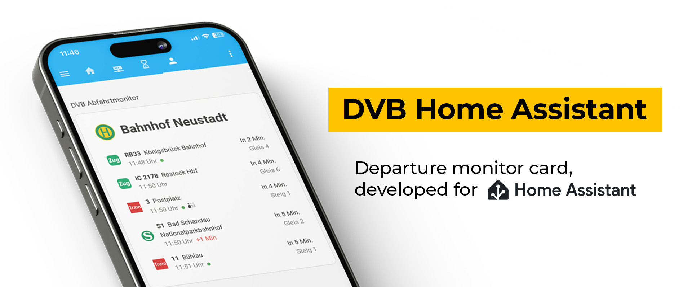

# DVB Home Assistant
Custom Lovelace card that acts as a departure monitor for the DVB (Dresden) and the entire VVO really.

## 📦 Installation
The easiest way to install DVB Home Assitant is via [HACS](https://www.hacs.xyz/).

## ✏️ Setup
After you've installed **DVB Home Assistant**, follow these steps to configure the card to your liking.

### 📌 Adding the card to your dashboard
1. **Open Your Dashboard for Editing**
- Navigate to **Home Assistant → Dashboard**
- Click the three-dot menu (⋮) → **Edit Dashboard**

2. **Add Calendar Card Pro**
- Click the ➕ **Add Card** button
- Search for `DVB` or scroll till you find `DVB Home Assistant`

3. **Select the card to add it to your dashboard**
- Configure with the Visual Editor
- Click the three dots `⋮` in the top-right corner of the card
- Select **"Configure"** to open the visual editor
- Follow the instructions below for further info.

### 🖌️ Customizing the card
If you're not happy with the Dresden Postplatz station (which is the default), you need to find the `stop_id` of your station.

#### How do I find the `stop_id`?

Glad you're asking! I haven't found a user-friendly way yet, so in the meantime copy the URL below into any browser, just change the word "Hauptbahnhof" to your station name. The first number (highlighted in the screenshot) is what you're looking for.

> https://webapi.vvo-online.de/tr/pointfinder?format=JSON&stopsOnly=True&query=%20Hauptbahnhof

Now go ahead and copy paste that number into the card config in Home Assistant.

## ⚙️ Development
To start a development server (assuming you have run `npm install` already), open two command lines. In the first one, you run
> npm run build:watch

and in the second one, you run 
> npm run start:watch

That way, we start `rollup` in it's "watch" mode and the `@web/web-dev-server` to serve a static html file from the `dev` folder. Not ideal, but works for now.

## 💕 Credits
- Thanks a lot to alexpfau's [calendar-card-pro](https://github.com/alexpfau/calendar-card-pro), I took some inspiration from its code.